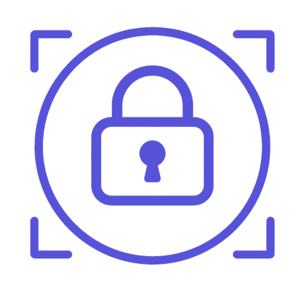
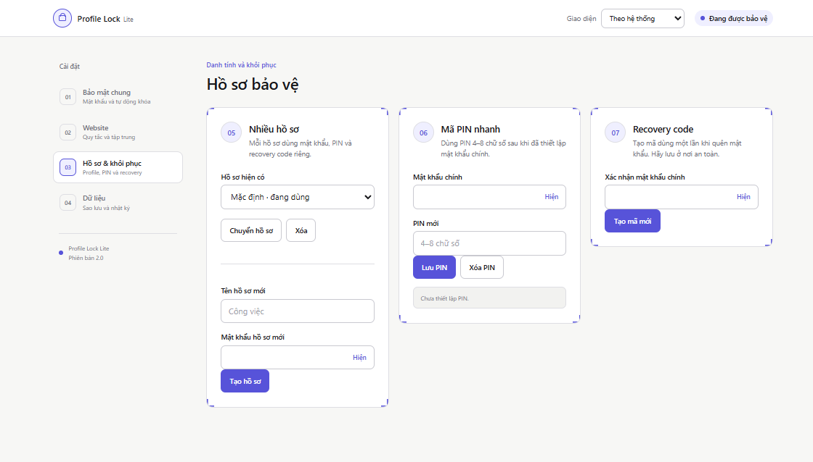

<p align="center">
  
</p>

<h1 align="center">Profile Lock Lite</h1>

<p align="center">
  Tiện ích <strong>khóa profile Chrome bằng mã PIN 4/6 số</strong>, bảo vệ website riêng tư và tự động khóa phiên duyệt web ngay trên thiết bị.
</p>

<p align="center">
  
  
  
</p>

## Khóa profile Chrome là gì?

**Profile Lock Lite** là Chrome extension giúp khóa phiên duyệt web bằng mã PIN 4 hoặc 6 số và recovery code. Tiện ích phù hợp khi bạn dùng chung máy tính, muốn hạn chế người khác mở profile Chrome, hoặc cần yêu cầu mã riêng khi truy cập một số website nhạy cảm.

Các từ khóa chức năng chính: **khóa profile Chrome**, **khóa Chrome bằng mật khẩu**, **Chrome profile lock**, **bảo vệ profile Chrome**, **khóa website trên Chrome** và **tự động khóa Chrome**.

> Dữ liệu xác thực được xử lý cục bộ. Extension không gửi mã PIN hay recovery code đến máy chủ bên ngoài.

## Giao diện

Dashboard sử dụng bố cục responsive, hỗ trợ giao diện **sáng**, **tối** hoặc tự động theo hệ thống. Người dùng có thể chọn bất kỳ **màu chủ đạo** nào bằng bảng chọn màu; màu nền phụ, viền focus và màu chữ trên nút sẽ tự điều chỉnh để giữ độ tương phản. Lựa chọn giao diện được lưu cục bộ và áp dụng đồng bộ cho dashboard, popup cùng màn hình mở khóa.

### Cài đặt khóa profile Chrome

Quản lý mã PIN chính, độ dài 4/6 số, thời gian tự động khóa, khóa khi mở Chrome và khóa khi máy sleep/locked.


### Khóa website và chế độ tập trung

Thiết lập website luôn yêu cầu mã PIN, website luôn được phép và mã PIN website độc lập với mã chính. Chế độ tập trung tạm chặn các tên miền gây xao nhãng trong thời gian đã chọn.


### PIN và recovery code

Extension bảo vệ một profile Chrome duy nhất. Người dùng chọn mã PIN chính 4 hoặc 6 số và dùng recovery code một lần khi quên mã.



### Sao lưu cấu hình và nhật ký bảo mật

Xuất/nhập thiết lập không chứa credential và xem tối đa 200 sự kiện bảo mật gần nhất được lưu trên máy.


## Tính năng

| Nhóm | Tính năng |
| --- | --- |
| Khóa profile Chrome | Khóa/mở khóa bằng mã PIN chính 4 hoặc 6 số, lưu bằng PBKDF2-SHA256 |
| Tự động khóa | Khóa khi Chrome khởi động, khi hệ thống sleep/locked hoặc sau thời gian không hoạt động |
| Bảo vệ website | Danh sách website luôn yêu cầu mã PIN và danh sách website luôn được phép |
| Mã PIN website | Đặt mã PIN riêng cho website, cùng độ dài với mã PIN chính |
| PIN Input | Mỗi số một ô, tự chuyển focus, hỗ trợ paste, phím mũi tên, ẩn/hiện, auto-submit và hiệu ứng lỗi |
| Khôi phục | Recovery code dùng một lần để đặt lại mã PIN khi quên mã chính |
| Chống dò mật khẩu | Lưu số lần nhập sai; sau lần thứ 5 khóa 60 giây, hiển thị đếm ngược và gửi thông báo hệ thống |
| Chống gỡ lớp khóa | Content script kiểm tra trạng thái mỗi 2 giây và tự dựng lại overlay; service worker giám sát tab và điều hướng |
| Khóa nhanh | `Ctrl+Shift+L` trên Windows/Linux hoặc `Command+Shift+L` trên macOS |
| Chế độ tập trung | Chặn tạm thời danh sách website trong khoảng 1–1.440 phút |
| Dữ liệu | Xuất/nhập cấu hình không chứa mật khẩu, PIN hoặc recovery credential |
| Nhật ký | Lưu cục bộ tối đa 200 sự kiện khóa, mở khóa và thay đổi bảo mật |
| Giao diện | Sáng, tối hoặc theo hệ thống; tự chọn màu chủ đạo, câu chào màn hình khóa và đồng bộ trên toàn bộ giao diện |

## Cơ chế bảo mật

- Credential mới dùng **PBKDF2-SHA256**, salt ngẫu nhiên riêng và 210.000 vòng lặp.
- Mã PIN không được lưu dưới dạng văn bản rõ.
- Credential SHA-256 từ phiên bản cũ được chuyển sang PBKDF2 sau lần xác thực hợp lệ.
- Nhập sai nhiều lần sẽ kích hoạt thời gian chờ tăng dần.
- Website đã mở khóa sẽ yêu cầu xác thực lại khi đóng tab cuối, chuyển khỏi tên miền, khóa màn hình, sleep, khóa Chrome, khởi động lại hoặc hết phiên 30 phút.
- Cấu hình xuất ra không chứa verifier, salt, mật khẩu, PIN hoặc recovery credential.

## Cài đặt thủ công

### Cách 1: Load trực tiếp mã nguồn

1. Tải repository hoặc clone dự án:

   ```powershell
   git clone https://github.com/truongminhkhanng/chrome-profile-lock.git
   cd chrome-profile-lock
   ```

2. Mở `chrome://extensions`.
3. Bật **Developer mode**.
4. Chọn **Load unpacked**.
5. Chọn thư mục dự án chứa `manifest.json`.
6. Tạo mã PIN khóa profile Chrome và lưu recovery code ở nơi an toàn.

### Cách 2: Build bản phân phối

Không cần cài dependency runtime. Chạy:

```powershell
npm run check
npm test
npm run build
```

Sau đó chọn thư mục `dist/` tại **Load unpacked**.

## Hướng dẫn sử dụng nhanh

### Đặt mã PIN khóa Chrome

1. Mở **Cài đặt → Bảo mật chung**.
2. Chọn **Mã PIN 4 số** hoặc **Mã PIN 6 số**.
3. Nhập và xác nhận mã PIN mới. Mỗi chữ số nằm trong một ô riêng.
4. Lưu recovery code được tạo ở lần thiết lập đầu tiên.
5. Chọn thời gian tự động khóa và các tùy chọn khóa khi khởi động/sleep.

Thời gian tự khóa có thể chọn: tắt, 1, 5, 15 hoặc 30 phút.

Khi đổi độ dài giữa 4 và 6 số, extension bắt buộc xác nhận mã hiện tại và đặt lại mã mới. Mã PIN được tự động gửi khi nhập đủ số; nút xác nhận vẫn có thể dùng dự phòng.

### Nâng cấp từ mật khẩu chữ cũ

Giao diện 2.2.0 chỉ nhận mã số. Nếu credential hiện tại được tạo bằng mật khẩu chữ ở phiên bản cũ, hãy chọn tab **Recovery**, nhập recovery code và đặt mã PIN 4/6 số mới. Extension không tự xóa hoặc tự chuyển credential cũ vì không thể suy ra mật khẩu từ verifier đã hash.

### Bắt website luôn yêu cầu mã PIN

1. Mở **Cài đặt → Website**.
2. Thêm mỗi tên miền trên một dòng, ví dụ `mail.google.com` hoặc `notion.so`.
3. Bấm **Lưu quy tắc**.
4. Nếu cần, xác nhận mã PIN chính và tạo mã PIN website riêng.

Quy tắc tên miền hỗ trợ cả tên miền chính và tên miền phụ.

### Khóa ngay profile Chrome

Mở popup trên thanh công cụ và bấm **Khóa ngay**, hoặc dùng nút **Khóa ngay** trong phần Bảo mật chung.

Bạn cũng có thể nhấn `Ctrl+Shift+L` (`Command+Shift+L` trên macOS). Chrome cho phép đổi tổ hợp này tại `chrome://extensions/shortcuts`.

### Đổi màu giao diện

1. Mở trang **Cài đặt** của extension.
2. Chọn chế độ **Theo hệ thống**, **Sáng** hoặc **Tối** trên thanh công cụ phía trên.
3. Bấm ô màu cạnh mục **Màu chủ đạo** và chọn màu mong muốn.
4. Bấm nút **↺** để trở về màu tím mặc định.

Màu đã chọn được lưu tự động trong `chrome.storage.local`, áp dụng cho toàn bộ giao diện và được giữ lại khi xuất/nhập cấu hình.

## Cấu trúc dự án

```text
chrome-profile-lock/
├── .gitignore
├── LICENSE
├── README.md
├── manifest.json
├── package.json
├── src/
│   ├── background.js       # Service worker và chính sách khóa
│   ├── content.js          # Lớp bảo vệ website
│   ├── crypto.js           # PBKDF2 và recovery code
│   ├── popup.*             # Popup thanh công cụ
│   ├── options.*           # Dashboard cài đặt
│   ├── lock.*              # Màn hình xác thực
│   └── assets/             # Icon, favicon và avatar
├── scripts/
│   └── build.cjs
├── tests/
│   ├── background-smoke.cjs
│   └── structure-smoke.cjs
├── docs/
│   ├── ARCHITECTURE.md
│   └── screenshots/
└── dist/                   # Đầu ra build, không commit
```

## Lệnh phát triển

```powershell
npm run check   # Kiểm tra cú pháp JavaScript
npm test        # Kiểm tra logic bảo mật và cấu trúc file
npm run build   # Tạo bản Load unpacked trong dist/
```

## Quyền Chrome

| Quyền | Mục đích |
| --- | --- |
| `storage` | Lưu cấu hình và credential đã dẫn xuất trên thiết bị |
| `tabs` | Đồng bộ trạng thái khóa theo tab và thu hồi phiên website |
| `windows` | Đưa màn hình khóa lên trước |
| `idle` | Phát hiện trạng thái idle/locked của hệ thống |
| `alarms` | Kiểm tra timeout và trạng thái sleep |
| `notifications` | Cảnh báo khi có 5 lần mở khóa sai liên tiếp |
| `webNavigation` | Giám sát điều hướng ở service worker và tái áp trạng thái khóa |
| `<all_urls>` | Áp dụng lớp bảo vệ cho website do người dùng cấu hình |

## Dữ liệu và quyền riêng tư

Extension sử dụng `chrome.storage.local`. Không có analytics, quảng cáo hoặc máy chủ đồng bộ. Nếu xóa extension hay xóa dữ liệu extension, mật khẩu, cấu hình và nhật ký cục bộ cũng sẽ bị xóa.

## Giới hạn cần biết

Profile Lock Lite là lớp bảo vệ ở cấp extension, không thay thế mật khẩu tài khoản hệ điều hành, mã hóa ổ đĩa hoặc chính sách quản trị doanh nghiệp.

- Chrome không cho content script hoạt động trên một số trang nội bộ như `chrome://`.
- Người có quyền quản trị thiết bị vẫn có thể tắt hoặc gỡ extension.
- Không nên xem extension là biện pháp chống lại người có toàn quyền truy cập máy tính.

## Câu hỏi thường gặp

### Extension có khóa toàn bộ profile Chrome tuyệt đối không?

Extension khóa hoạt động duyệt web mà Chrome cho phép extension kiểm soát. Các trang nội bộ `chrome://` và thao tác gỡ extension vẫn chịu giới hạn của trình duyệt.

### Mã PIN khóa profile Chrome được lưu ở đâu?

Chỉ credential đã dẫn xuất được lưu trong `chrome.storage.local`; mã PIN dạng rõ không được lưu.

### Có thể dùng mã PIN khác cho website không?

Có. Phần Website cho phép đặt mã PIN riêng, độc lập với mã PIN chính.

### Quên mã PIN thì làm gì?

Dùng recovery code đã nhận khi thiết lập để bắt đầu quy trình đặt lại mật khẩu. Nếu mất cả recovery code, không có máy chủ bên ngoài để khôi phục dữ liệu thay bạn.

### Extension có gửi dữ liệu ra Internet không?

Không. Dữ liệu bảo mật và nhật ký được lưu cục bộ trên thiết bị.

## Phiên bản

Phiên bản hiện tại: **2.2.0** — Manifest V3, single-profile, PIN 4/6 số.

## Giấy phép

Copyright © 2026 `truongminhkhanng`. Xem [LICENSE](LICENSE). Dự án hiện được bảo lưu mọi quyền.
