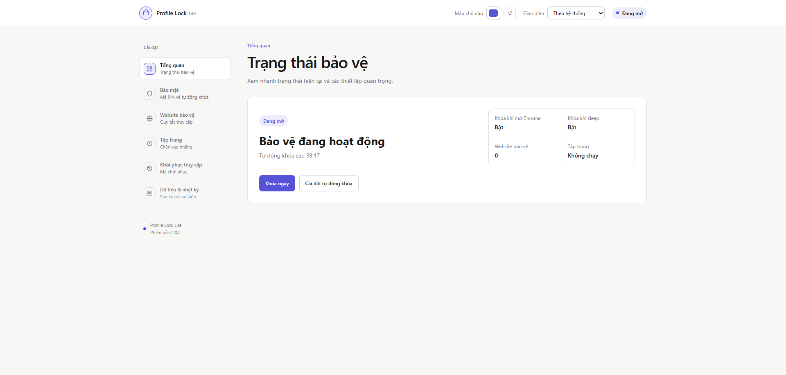
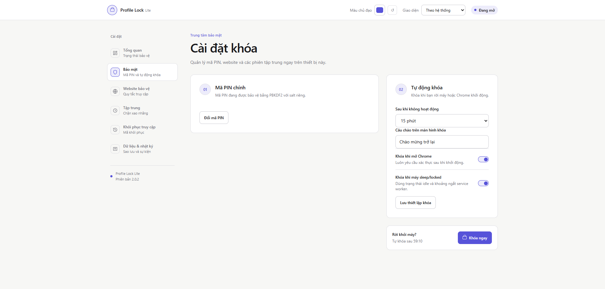
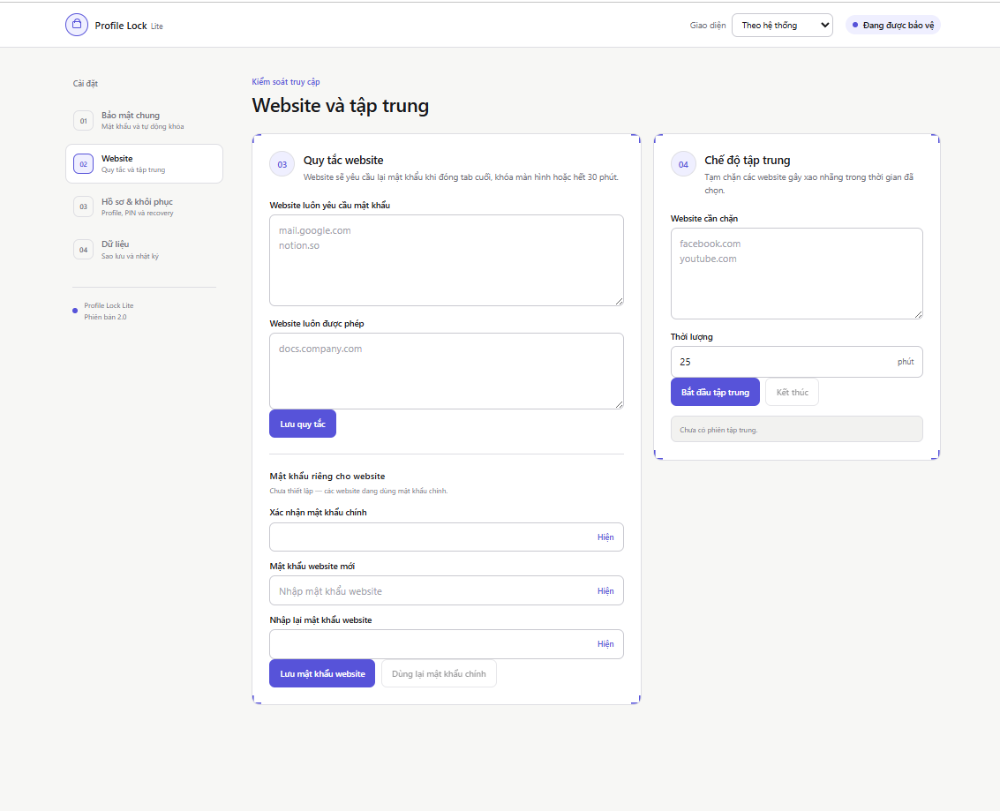
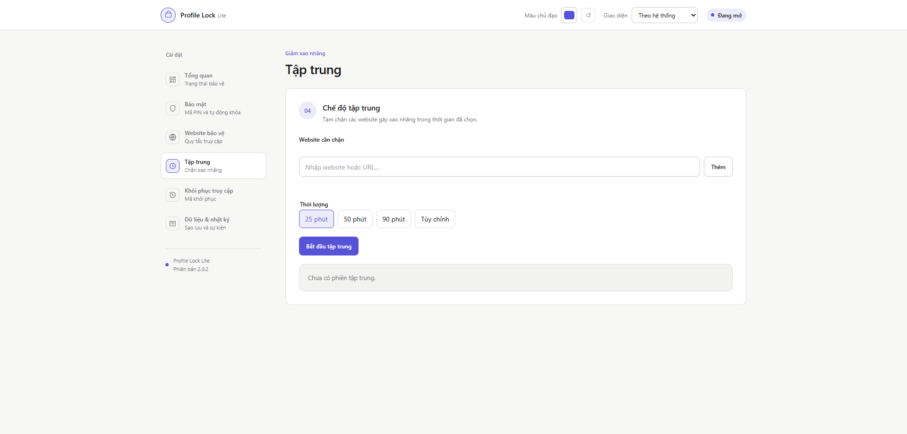
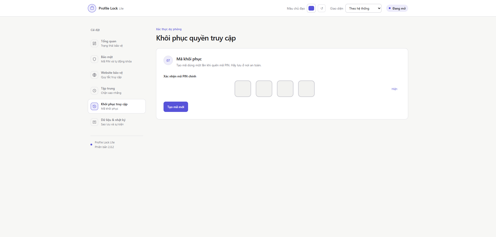
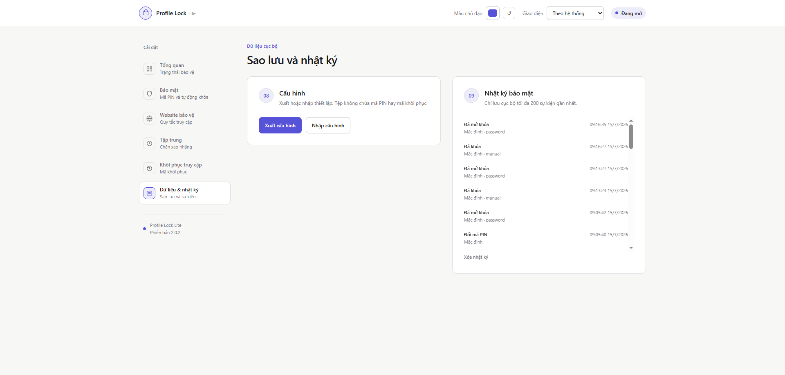

# Chrome Profile Lock Lite

Chrome Extension Manifest V3 bảo vệ một profile Chrome bằng **mã PIN chính 4 hoặc 6 số**. Toàn bộ credential, cấu hình và nhật ký được xử lý cục bộ; extension không gửi dữ liệu xác thực ra máy chủ.

Phiên bản hiện tại: **2.0.2**.

## Tính năng

- Onboarding ba bước: tạo mã PIN chính, lưu mã khôi phục, chọn quy tắc tự động khóa.
- Mở khóa bằng PIN Input dùng chung: mỗi số một ô, tự chuyển focus, paste, phím mũi tên, ẩn/hiện, tự gửi và hiệu ứng báo sai.
- Mã PIN chính và mã PIN website được dẫn xuất bằng PBKDF2-SHA256 với salt ngẫu nhiên và 210.000 vòng lặp.
- Mã khôi phục dùng một lần để lấy lại quyền truy cập khi quên mã PIN chính.
- Chống dò mã: lưu số lần sai, khóa tạm sau lần thứ năm, đếm ngược và thông báo hệ thống.
- Tự khóa khi Chrome khởi động, hệ điều hành sleep/locked hoặc hết thời gian không hoạt động.
- Khóa nhanh bằng `Ctrl+Shift+L` trên Windows/Linux hoặc `Command+Shift+L` trên macOS.
- Popup hiển thị trạng thái profile và website của tab hiện tại; có thể bảo vệ hoặc bỏ bảo vệ ngay tại popup.
- Quản lý website bằng chip tên miền, hỗ trợ URL đầy đủ, paste nhiều dòng và kiểm tra xung đột.
- Mã PIN website riêng, độc lập với mã PIN chính.
- Chế độ Tập trung riêng với mốc 25/50/90 phút hoặc thời lượng tùy chỉnh.
- Dashboard tổng quan trạng thái, thời gian tự khóa, số website bảo vệ và phiên tập trung.
- Giao diện sáng, tối hoặc theo hệ thống; chọn màu chủ đạo tùy ý. Màu chữ và màu tương tác tự hiệu chỉnh để giữ độ tương phản.
- Xuất/nhập cấu hình không chứa mã PIN, mã khôi phục, verifier hoặc salt; nhật ký tối đa 200 sự kiện.
- Khôi phục cài đặt mặc định mà không xóa mã PIN, mã khôi phục hoặc nhật ký bảo mật.

## Giao diện

### Tổng quan trạng thái



### Bảo mật và tự động khóa



### Website bảo vệ



### Chế độ Tập trung



### Khôi phục quyền truy cập



### Dữ liệu và nhật ký bảo mật



## Cài đặt

### Load trực tiếp mã nguồn

1. Clone repository và mở thư mục dự án.
2. Mở `chrome://extensions`.
3. Bật **Developer mode**.
4. Chọn **Load unpacked** và chọn thư mục có `manifest.json`.
5. Hoàn thành ba bước thiết lập. Hãy sao chép hoặc tải file chứa mã khôi phục và lưu ở nơi an toàn.

### Build bản phân phối

```powershell
npm run check
npm test
npm run build
```

Sau đó load thư mục `dist/` tại `chrome://extensions`.

## Sử dụng

### Website bảo vệ

Mở **Cài đặt → Website bảo vệ**, nhập URL hoặc tên miền rồi nhấn Enter. Component tự chuẩn hóa hostname, giữ tên miền phụ và từ chối các URL nội bộ như `chrome://`. Có thể paste danh sách phân cách bằng dấu phẩy hoặc xuống dòng, hoặc dùng **Thêm website đang mở**.

Popup chỉ hiện thao tác theo tab hiện tại khi đó là trang HTTP/HTTPS và profile đang mở. Nếu website nằm trong “Luôn cho phép”, popup yêu cầu xác nhận chuyển website sang danh sách bảo vệ.

### Chế độ Tập trung

Mở **Cài đặt → Tập trung**, thêm các website gây xao nhãng, chọn 25/50/90 phút hoặc thời lượng tùy chỉnh rồi bắt đầu. Khi đang chạy, giao diện hiển thị thời gian còn lại và nút kết thúc sớm có hộp thoại xác nhận.

### Khôi phục quyền truy cập

Trên màn hình khóa, chọn tab **Mã khôi phục**, nhập mã đã lưu và đặt mã PIN chính mới trong thời hạn cho phép. Mã khôi phục là mã dùng một lần. Nếu mất cả mã PIN chính lẫn mã khôi phục, không có máy chủ bên ngoài để khôi phục thay bạn.

### Đổi màu giao diện

Trong thanh trên cùng của trang cài đặt, chọn chế độ sáng/tối/theo hệ thống và màu chủ đạo. Lựa chọn được lưu trong `chrome.storage.local` và dùng đồng bộ trên dashboard, popup và màn hình khóa. Nếu màu đã chọn không đủ tương phản cho nút hoặc focus, extension dùng một biến thể sáng/tối hơn nhưng vẫn giữ màu gốc cho các chi tiết trang trí.

## Cơ chế bảo mật

- Mã PIN dạng rõ không được lưu hoặc ghi log.
- Credential cũ SHA-256 được giữ tương thích và nâng cấp sang PBKDF2 sau lần xác thực hợp lệ.
- Số lần nhập sai và thời điểm hết khóa tạm được lưu để reload không làm mất giới hạn.
- Content script kiểm tra định kỳ và tái tạo lớp khóa nếu bị xóa; service worker giám sát trạng thái tab và điều hướng.
- Website đã mở khóa yêu cầu xác thực lại khi đóng tab cuối, hết phiên, profile bị khóa hoặc thiết bị sleep/locked.
- Đây là lớp bảo vệ ở cấp extension, không thay thế khóa tài khoản hệ điều hành, mã hóa ổ đĩa hoặc chính sách quản trị. Chrome không cho content script chạy trên một số trang nội bộ và người có quyền quản trị máy vẫn có thể tắt extension.

Xem thêm [SECURITY_REVIEW.md](SECURITY_REVIEW.md).

## Cấu trúc chính

```text
src/
├── background.js       # Service worker, state và chính sách khóa
├── crypto.js           # PBKDF2 và mã khôi phục
├── content.js          # Lớp bảo vệ website
├── pin-input.*         # PIN Input dùng chung
├── domain-utils.js     # Chuẩn hóa hostname
├── theme-utils.js      # Tính độ tương phản màu
├── ui-components.*     # Domain chips và modal dùng chung
├── popup.*             # Popup theo ngữ cảnh tab
├── options.*           # Onboarding và dashboard
└── lock.*              # Màn hình mở khóa
```

## Kiểm thử thủ công trước release

- Onboarding: kiểm tra PIN 4 và 6 số, PIN xác nhận sai, sao chép/tải mã khôi phục, nút tiếp tục bị khóa khi chưa xác nhận đã lưu.
- Tải lại hoặc đóng/mở lại trang ở bước mã khôi phục; xác nhận phải tạo mã mới trước khi tiếp tục.
- PIN Input: nhập đúng/sai, paste, Backspace, mũi tên, ẩn/hiện, tự gửi và shake.
- Nhập sai năm lần, tải lại trang và kiểm tra đếm ngược vẫn tiếp tục.
- Popup trên website bảo vệ, chưa bảo vệ, `chrome://` và khi profile đang khóa.
- Thêm URL đầy đủ, tên miền phụ, nhiều dòng, URL sai và website trùng giữa hai danh sách.
- Tập trung: preset, thời lượng tùy chỉnh, đếm ngược và kết thúc sớm.
- Tự khóa: khi khởi động, idle, sleep/locked và phím tắt.
- Xóa overlay bằng DevTools và điều hướng tab khi đang khóa.
- Giao diện sáng/tối/theo hệ thống; thử màu rất sáng, rất tối và kiểm tra focus bằng bàn phím.
- Xuất/nhập cấu hình và xác nhận file không có credential.

## Quyền riêng tư

Extension không có analytics, quảng cáo hoặc máy chủ đồng bộ. Xóa extension hoặc dữ liệu extension sẽ xóa credential, cấu hình và nhật ký cục bộ.

## Giấy phép

Copyright © 2026 `truongminhkhanng`. Xem [LICENSE](LICENSE).
